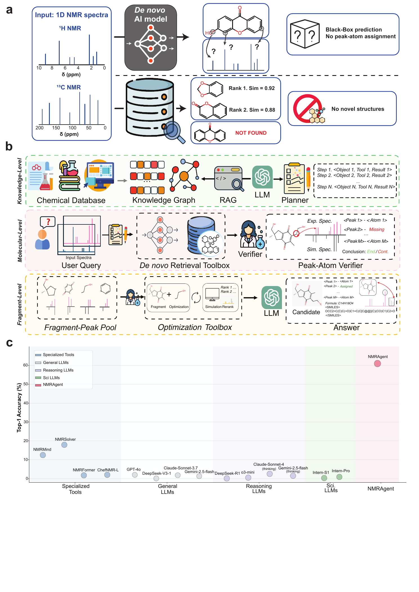

# NMRAgent

Official repository for **Towards Generalizable and Evidential Nuclear Magnetic Resonance-Based Molecular Structure Elucidation via Large Language Model Agent**.



[PDF version of the overview figure](docs/assets/NMRAgent_BC1.pdf)

NMRAgent is a LangGraph-based agent framework for NMR-driven molecular structure elucidation. The repository contains the agent runtime, tool wrappers, service entrypoints, and environment templates. Large model/data artifacts and machine-local configs are not part of the public repository.

## 1. Install Environment

Use the clean conda environment file first:

```bash
conda env create -f environment.yml
conda activate nmragent
pip install -e .
```

`environment.yml` is the public, reproducible environment. Do not publish machine snapshots such as `environment.full.lock.yml` or `environment.nmragent.yml`.

## 2. Configure Data and Model Paths

All checkpoint/data paths are configured through runtime asset config files. The loader checks these files in order:

```text
configs/runtime_assets.local.json
configs/runtime_assets.json
configs/runtime_assets.example.json
```

For a new machine, copy the example and edit the local file:

```bash
cp configs/runtime_assets.example.json configs/runtime_assets.local.json
```

Put private absolute paths only in `configs/runtime_assets.local.json`. This file is ignored by git.

Important fields:

```json
{
  "env": {
    "NMR_CKPT_DIR": "artifacts/checkpoints",
    "NMR_SEARCH_CKPT": "artifacts/checkpoints/search.pth",
    "NMR_DENOVO_CKPT": "artifacts/checkpoints/denovo_v3.pth",
    "NMR_NMRNET_DIR": "artifacts/checkpoints/NMRNet_ckpt",
    "NMR_RETRIEVAL_LMDB": "artifacts/checkpoints/embeddings_with_smiles.lmdb",
    "NMR_FAISS_INDEX_PATH": "artifacts/checkpoints/faiss.index",
    "NMR_ID_MAP_PATH": "artifacts/checkpoints/id_mapping.pkl",
    "NMR_FORMULA_MAP_PATH": "artifacts/checkpoints/formula_to_ids_new.pkl",
    "NMR_KG_DATA_DIR": "artifacts/kg",
    "NMR_CHEMBERTA_PATH": "artifacts/chemberta"
  }
}
```

Meaning:

- `NMR_CKPT_DIR`: root directory for model/data artifacts
- `NMR_SEARCH_CKPT`: retrieval model checkpoint
- `NMR_DENOVO_CKPT`: de novo generation checkpoint
- `NMR_NMRNET_DIR`: NMRNet/rerank checkpoint directory
- `NMR_RETRIEVAL_LMDB`: retrieval LMDB database
- `NMR_FAISS_INDEX_PATH`: retrieval FAISS index
- `NMR_ID_MAP_PATH`: retrieval ID map
- `NMR_FORMULA_MAP_PATH`: formula-to-ID map
- `NMR_KG_DATA_DIR`: KG/RAG files
- `NMR_CHEMBERTA_PATH`: ChemBERTa tokenizer/model path

The public repository should only contain `configs/runtime_assets.example.json`. Real paths should stay in `configs/runtime_assets.local.json`.

## 3. Configure LLM API

LLM backend config is loaded from:

```text
configs/multi_agent_api.local.yaml
configs/multi_agent_api.yaml
configs/multi_agent_api.example.yaml
```

For local use:

```bash
cp configs/multi_agent_api.example.yaml configs/multi_agent_api.local.yaml
```

Example:

```yaml
openai_compatible:
  backend: openai
  model: gpt-4o-mini
  base_url: https://api.openai.com/v1
  api_key_env: OPENAI_API_KEY
  max_tokens: 4096
  temperature: 0.0
```

Then set:

```bash
export OPENAI_API_KEY=...
```

Do not commit `configs/multi_agent_api.local.yaml` if it contains keys or private endpoints.

## 4. One-Shot Multi-Agent Run Mode

Use this mode for one NMR case and one final JSON result:

```bash
python scripts/run_multi_agent_nmr.py \
  --formula C20H30O3 \
  --h-shifts 5.68 3.19 2.98 2.68 2.59 1.86 1.77 1.69 1.57 1.56 1.44 1.32 1.23 1.20 1.11 1.02 0.94 \
  --c-shifts 210.38 182.46 172.23 111.19 86.84 56.39 46.03 42.31 41.72 40.55 40.20 37.25 34.24 33.51 21.71 19.45 18.34 18.07 17.90 17.51 \
  --model gpt-4o-mini \
  --textbook-rag \
  --kg-rag
```

Dry-run wiring test without loading retrieval/de novo/rerank tools:

```bash
python scripts/run_multi_agent_nmr.py \
  --formula C8H10N4O2 \
  --h-shifts 3.4 3.6 \
  --c-shifts 28.1 149.5 \
  --dry-run-tools \
  --print-trace-tail 20
```

Useful flags:

```bash
--textbook-rag --textbook-rag-top-k 5
--kg-rag --kg-rag-top-k 5 --kg-rag-neighbor-limit 0
--web-rag --web-rag-top-k 5
--use-service-tools
```

`--use-service-tools` makes retrieval/de novo calls through HTTP services instead of initializing those models in the agent process.

## 5. Terminal Multi-Turn Chat Mode

Use terminal chat when you want to paste data over multiple turns:

```bash
python scripts/chat_agent.py --textbook-rag --kg-rag
```

Commands inside terminal chat:

```text
/show   show accumulated formula/shifts/note
/rag    preview RAG evidence
/solve  run the multi-agent solver
/reset  clear current case
/quit   exit
```

## 6. Web Chat Frontend

Start the web chat UI:

```bash
python scripts/chat_agent_web.py --host 0.0.0.0 --port 7860
```

Open:

```text
http://127.0.0.1:7860
```

Web chat behavior:

- ordinary messages go to the configured OpenAI-compatible chat API
- pasted Formula / 1H / 13C text is accumulated into the current LangGraph thread state
- `rag` previews evidence
- `solve` runs the multi-agent NMR solver
- `demo` loads the built-in demo case
- `show` shows current accumulated state
- `reset` clears the current session

If you have persistent model services running, enable `Use retrieval/denovo services` in the UI before sending `solve`.

## 7. Persistent Retrieval and De Novo Services

Persistent services avoid repeatedly loading retrieval/de novo models inside the chat or CLI process.

Start both model services:

```bash
bash Service/start_nmr_services_tmux.sh
```

Default endpoints:

```text
Retrieval service: http://127.0.0.1:8011/retrieve
De novo service:   http://127.0.0.1:8012/denovo
```

Health check:

```bash
bash Service/check_nmr_services.sh
```

If a port is occupied, override it:

```bash
NMR_DENOVO_SERVICE_PORT=8014 bash Service/start_denovo_service.sh
```

Then point the agent/chat process to the custom URL:

```bash
export NMR_RETRIEVAL_SERVICE_URL=http://127.0.0.1:8011
export NMR_DENOVO_SERVICE_URL=http://127.0.0.1:8014
```

## 8. Full Local Chat Stack

For local development, this helper starts retrieval, de novo, and web chat in tmux sessions:

```bash
bash Service/start_chat_stack.sh
```

Defaults:

```text
Retrieval: http://127.0.0.1:8011
De novo:   http://127.0.0.1:8012
Chat UI:   http://127.0.0.1:7860
```

Override ports when needed:

```bash
NMR_DENOVO_SERVICE_PORT=8014 bash Service/start_chat_stack.sh
```

Logs:

```text
logs/services/retrieval_8011.log
logs/services/denovo_8012.log
logs/chat_agent_web_7860.log
```

## 9. Optional Web RAG Keys

Web RAG is optional. Configure one provider:

```bash
export TAVILY_API_KEY=...
# or
export SERPER_API_KEY=...
# or
export BRAVE_SEARCH_API_KEY=...
```

## 10. Acknowledgements

We thank our collaborators for helpful discussions on NMR spectroscopy, natural-product structure elucidation, and experimental validation. We also acknowledge the maintainers and contributors of the open-source software and public scientific resources that make NMRAgent possible, including LangGraph, RDKit, FAISS, and the NMR data resources used in this project.
